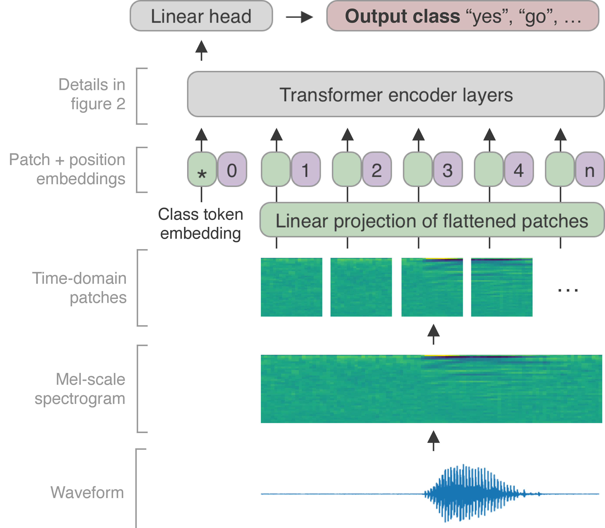

# Keyword Transformer (KWT) - TAU Final Project

**Course:** Advanced Topics in Audio Processing using Deep Learning  
**Instructor:** Tal Rosenwein  
**Team Members:** Shir Rashkovits, Shoham Mazuz, Gal Getz, Omer Ventura

---

## 📝 Overview
This repository contains our implementation and reproduction of the **Keyword Transformer (KWT)**, based on the research by Axel Berg et al. 

Our project specifically focuses on the **KWT-1** architecture (the lightweight variant) for the **12-label keyword spotting task** using the Google Speech Commands V2 dataset. We explore the efficiency of the reproducibility and the efficacy of the model by comparing two training strategies:
1. **Baseline:** Training KWT-1 from scratch.
2. **Distillation:** Leveraging a pre-trained **Att-MH-RNN** teacher (CNN-RNN architecture) to guide the student Transformer.

Our analysis focuses on the comparison between model trained from scratch and the one trained with distillation.

<p align="center">
  
  <br>
  <em>Figure 1: KWT Architecture - From Mel-Spectrogram patches to Transformer Encoder outputs.</em>
</p>


---

## 📂 Repository Structure

```text
.
├── audio_samples/           # Dataset samples (V2-12), background noise, and train, validation examples.
├── models_data_v2_12/       # Training artifacts: Checkpoints (.ckpt), TensorBoard logs, and flags.
├── scripts/                 # Slurm/Bash scripts for remote training (.sh) and evaluation.
├── kws_streaming/           # Core logic: Model definitions (KWT), data loaders, and training loops.
├── assets/                  # Project visualizations, architecture diagrams, and result plots.
├── requirements.txt         # Python dependencies.
└── README.md                # Project documentation.
```

---


## 🛠 Setup & Requirements
This project is built and tested using **Python 3.10** on **macOS (Apple Silicon)**.

1. **Environment Setup:**
```bash
python3.10 -m venv venv3
source venv3/bin/activate
pip install --upgrade pip
pip install -r requirements.txt

```

2. **Data Preparation:**
To download and extract the Google Speech Commands V2 dataset:

```bash
wget [https://storage.googleapis.com/download.tensorflow.org/data/speech_commands_v0.02.tar.gz](https://storage.googleapis.com/download.tensorflow.org/data/speech_commands_v0.02.tar.gz)
mkdir data2
mv ./speech_commands_v0.02.tar.gz ./data2
cd ./data2
tar -xf ./speech_commands_v0.02.tar.gz
cd ../

```

---

## 🚀 How to Run

### 1. Evaluation (Performance & Latency)

To evaluate the accuracy and measure the inference latency (Batch Size = 1), run:

```bash
# To evaluate the Baseline model:
sh scripts/evaluate.sh kwt1_baseline

# To evaluate the Distilled model:
sh scripts/evaluate.sh kwt1_distill

```

### 2. Training

* **From Scratch:** `sh scripts/train_baseline.sh`
* **With Distillation:** `sh scripts/train_distill.sh` (Requires teacher weights in `models_data_v2_12_labels/`)

---

## 📊 Results & Visualization

### **TensorBoard Logs**
To visualize training progress, loss curves, and accuracy from the initial 24-hour run, execute the following command from the project root:

```bash
tensorboard --logdir ./models_data_v2_12_labels/first_run_on_server/
```

> **Note:** This directory contains synchronous logs for both the **Baseline** and **Distillation** experiments, allowing for side-by-side comparison in the TensorBoard dashboard.

### **Checkpoints & Models**

The trained weights (checkpoints) and configuration flags for these experiments are organized as follows:

| Experiment | Directory Path |
| --- | --- |
| **Baseline (KWT1)** | `models_data_v2_12_labels/first_run_on_server/kwt1_baseline/` |
| **Distillation (KWT1)** | `models_data_v2_12_labels/first_run_on_server/kwt1_distill/` |

---

## ⚠️ Challenges & Modifications

* **Hardware Adaptation:** Optimized for **Apple Silicon** by adjusting batch sizes and memory usage.
* **Architecture Scaling:** Explicitly modified the pipeline to target the **KWT-1** variant ($d_{model}=64$, $h=1$).
* **Data Generator:** Patched the `unknown` class sampling logic to ensure compatibility with modern TensorFlow versions.
