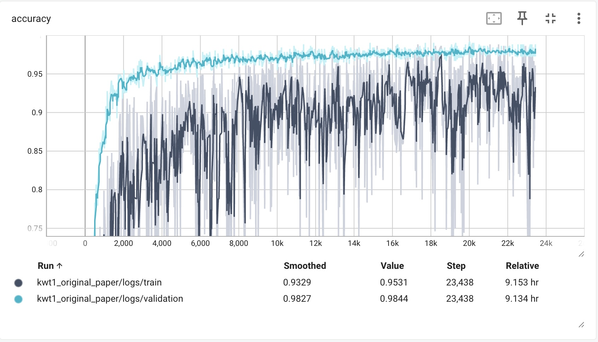
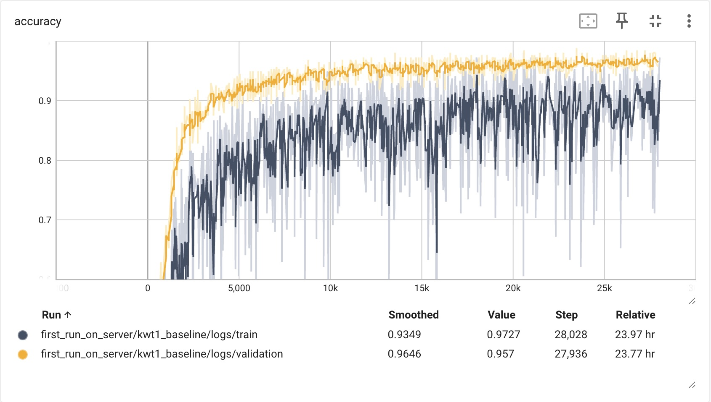
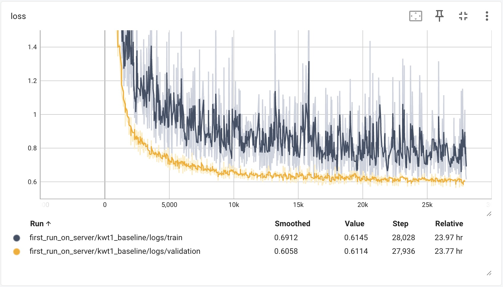
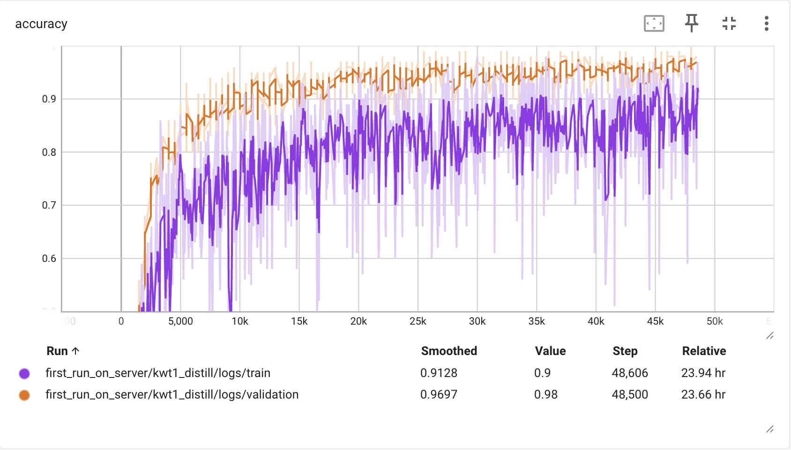
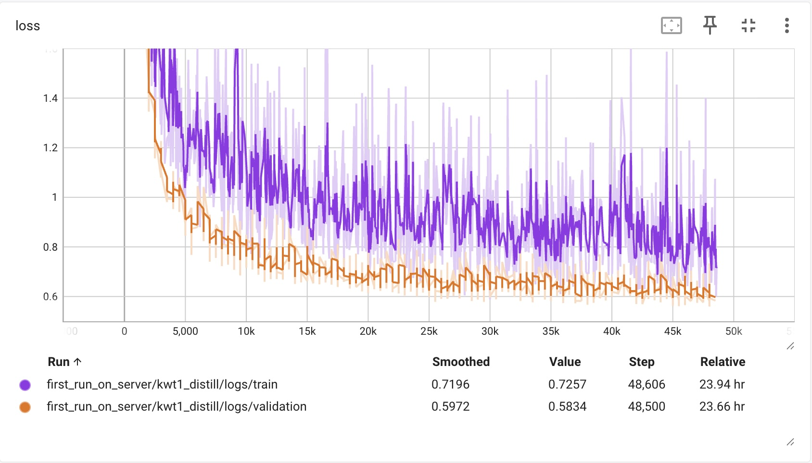
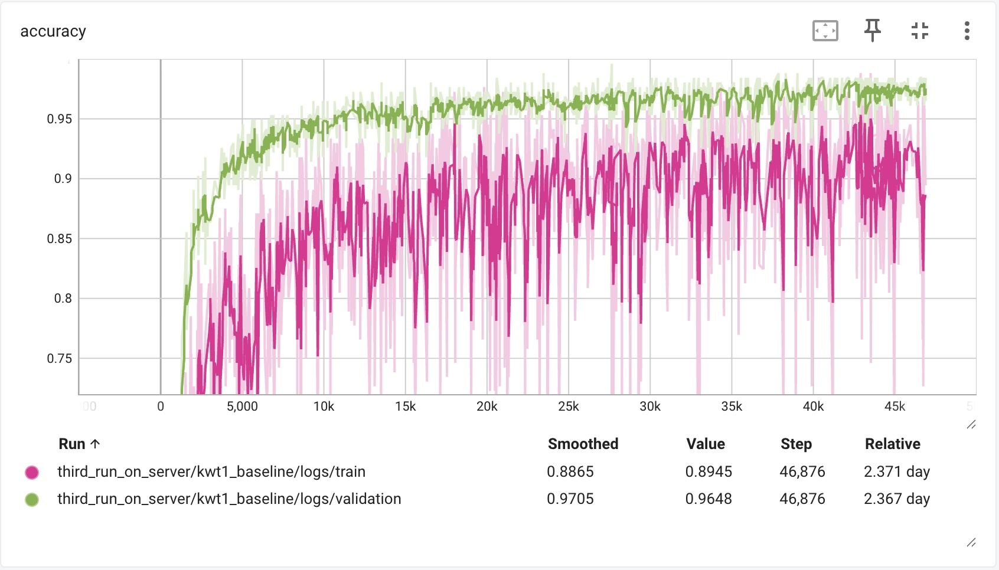
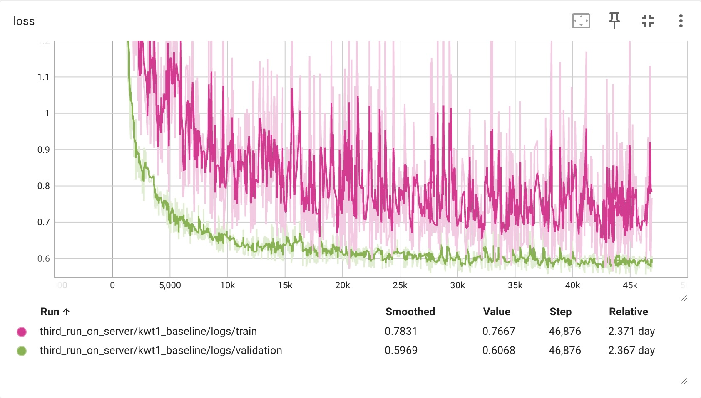
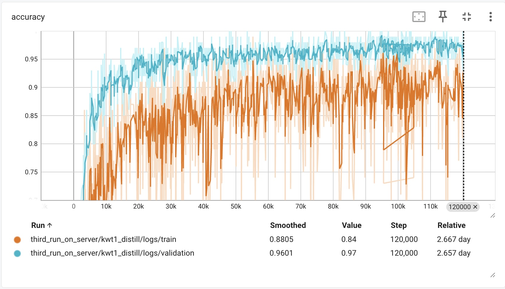
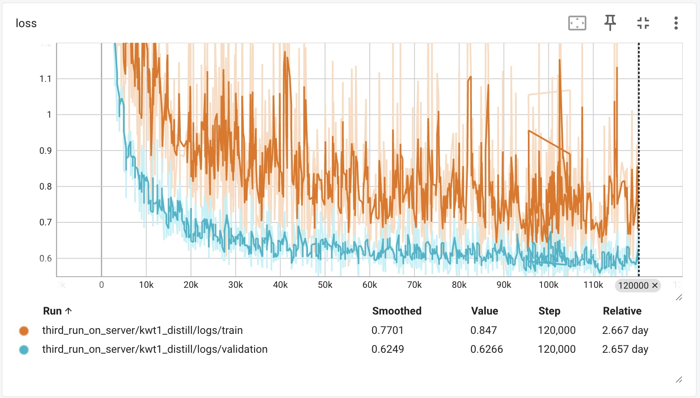

# Training Runs Analysis

> **Date:** 2026-03-21 | **Branch:** `feat/update-scripts-and-readme` | **Checkpoints:** `models_data_v2_12_labels/`

---

## TL;DR

| Checkpoint | Baseline | Distillation | Paper Target |
|:-----------|:---------|:-------------|:-------------|
| Original paper authors | **97.71%** | -- | 97.72% / 98.08% |
| Our 1st SLURM job (~24h, partial) | 97.08% | 96.17% | |
| Our 1st + 2nd SLURM jobs | 97.44% | 97.13% | |
| Our full run (1st + 2nd + 3rd jobs) | **97.52%** | **97.06%** | |

The original paper checkpoint reproduces perfectly (97.71% vs 97.72%). Our baseline gets close (97.52%) but our distillation (97.06%) never overtakes the baseline and falls well short of the paper's 98.08%. The root cause is a code change that replaced **AdamW** (with weight decay) with **plain Adam** (no regularization), compounded by several other deviations from the paper's setup.

---

## 1. What the Paper Prescribes

All KWT experiments in Berg et al. share a single set of hyperparameters (Table 2):

| Parameter | Value |
|:----------|:------|
| Optimizer | AdamW |
| Weight decay | 0.1 |
| Learning rate | 0.001 |
| Batch size | 512 |
| Steps | 23,000 |
| Warmup epochs | 10 |
| Label smoothing | 0.1 |
| LR schedule | Cosine |

---

## 2. What We Ran

### Baseline (`scripts/train_baseline.slurm`)

| Parameter | Ours | Paper | Issue |
|:----------|:-----|:------|:------|
| Optimizer | Adam | AdamW | **Bug** -- weight decay removed |
| Weight decay | 0 (code ignores flag) | 0.1 | **Bug** |
| Learning rate | 0.0005 | 0.001 | Half |
| Batch size | 256 | 512 | Half |
| Steps | 46,876 | 23,000 | Scaled for batch size (same 12M examples) |
| Warmup epochs | 10 | 10 | OK |
| Effective LR | 0.00025 | 0.001 | 4x lower (LR is scaled by `batch/512`) |

### Distillation (`scripts/train_distill.slurm`)

| Parameter | Ours | Paper | Issue |
|:----------|:-----|:------|:------|
| Optimizer | Adam | AdamW | **Bug** -- same as baseline |
| Weight decay | 0 | 0.1 | **Bug** -- also passed `--l2_weight_decay 0.0` |
| Learning rate | 0.0005 | 0.001 | Half |
| Batch size | **100** | 512 | **5x smaller** (inherited from upstream ARM repo) |
| Steps | 120,000 | 23,000 | Scaled for batch size (same 12M examples) |
| Warmup epochs | 5 | 10 | Half |
| Effective LR | **0.0001** | 0.001 | **10x lower** |
| Gradient updates | **120k** | 23k | **5x more** weight updates |

> The `batch_size=100` for distillation was copied from the upstream ARM repo's `distill.sh` and the default in `model_params.py:74`. It contradicts the paper.

---

## 3. Training Curves

### Original Paper KWT-1 (reference)

The paper authors' training with correct AdamW, `batch_size=512`, 23,000 steps:



Validation accuracy reaches ~98% with smooth convergence. Train accuracy is noisy (~93%) due to augmentation -- this gap is normal and expected.

---

### 1st SLURM Job (~24 hours, partial training)

The first SLURM job ran on the `studentkillable` partition for ~24 hours before being preempted. Baseline reached ~28k of 47k steps. Distillation reached ~48k of 120k steps.

**Baseline** -- accuracy and loss:




The baseline behaves well. Validation accuracy (orange) rises quickly to ~96% and stabilizes. Train accuracy (dark gray) is noisy but improves steadily. Loss curves show healthy convergence -- validation loss drops smoothly to ~0.61.

**Distillation** -- accuracy and loss:




Distillation starts slower than baseline. At 48k steps, validation accuracy is ~98% and still improving. Train accuracy is much noisier and lower (~85-90%) -- partly because training measures a single head on augmented data, while validation measures the ensemble on clean data. Loss is still decreasing, suggesting the model hasn't converged yet.

---

### Full Run (3rd SLURM Job -- all training completed)

After three SLURM jobs, baseline completed all 46,876 steps and distillation completed all 120,000 steps.

**Baseline** -- accuracy and loss:




The full baseline training looks similar to the partial run. Validation accuracy (green) plateaus at ~97%, close to the paper's 97.72%. Validation loss settles at ~0.60. The model is well-trained and not overfitting.

**Distillation** -- accuracy and loss:




The distillation model trains for 120k steps but only reaches ~97% validation accuracy -- roughly the same as baseline despite 2.5x more gradient updates. Train accuracy (orange) plateaus around 88% and becomes increasingly noisy after ~80k steps. Validation loss settles at ~0.63, slightly higher than baseline's 0.60.

The distillation model shows signs of not benefiting from the extended training: after ~60k steps, there's little improvement. Without weight decay, the extra 70k steps don't help -- they just add noise.

---

### Comparing Baseline vs Distillation

| Metric | Baseline (47k steps) | Distillation (120k steps) | Paper Baseline | Paper Distill |
|:-------|:---------------------|:--------------------------|:---------------|:--------------|
| Val accuracy | ~97% | ~97% | ~97.7% | ~98.1% |
| Train accuracy | ~89% | ~88% | ~93% | -- |
| Val loss | 0.60 | 0.63 | -- | -- |
| **Test accuracy** | **97.52%** | **97.06%** | **97.72%** | **98.08%** |

In the paper, distillation improves accuracy by +0.36%. In our runs, distillation is **0.46% worse** than baseline. The distillation model trains for longer but learns less effectively because:
- No weight decay means the teacher signal doesn't regularize as intended
- The very low effective LR (0.0001 vs paper's 0.001) slows convergence
- 120k gradient updates without regularization leads to noisier, less stable training

---

## 4. Test Set Results

We evaluated all available checkpoints on the **test set** (unseen during both training and validation).

| Checkpoint | Baseline | Distillation |
|:-----------|:---------|:-------------|
| Original paper authors' KWT-1 | **97.71%** | -- |
| 1st SLURM job (~24h, partial) | 97.08% | 96.17% |
| 1st + 2nd SLURM jobs | 97.44% | 97.13% |
| **Full run (1st + 2nd + 3rd jobs)** | **97.52%** | **97.06%** |
| **Paper target** | **97.72%** | **98.08%** |

Key observations:
- The **original paper checkpoint reproduces** their reported result (97.71% vs 97.72%).
- Our baseline **improved** with each continued run (97.08% -> 97.44% -> 97.52%), getting close to the paper.
- Our distillation **also improved** (96.17% -> 97.13% -> 97.06%), but **never overtakes the baseline** and falls ~1% short of the paper's 98.08%.
- Distillation should outperform baseline (paper shows +0.36%), but ours is 0.46% worse -- confirming the missing weight decay is the bottleneck.

### How to reproduce

```bash
source venv3/bin/activate
export PYTHONPATH=$(pwd):$PYTHONPATH
export TF_USE_LEGACY_KERAS=1

# Baseline (replace path with any run's checkpoint dir)
python eval_checkpoint.py \
  ./models_data_v2_12_labels/third_run_on_server/kwt1_baseline/ \
  ./data2/speech_commands_v0.02/ \
  --mel_upper_edge_hertz 7600 --mel_num_bins 80 --dct_num_features 40 \
  --window_size_ms 30.0 --window_stride_ms 10.0 \
  kws_transformer --num_layers 12 --heads 1 --d_model 64 --mlp_dim 256 \
  --dropout1 0. --attention_type "time"

# Distillation (replace path with any run's checkpoint dir)
python eval_checkpoint.py \
  --distill ./distill_att_mh_rnn.json \
  ./models_data_v2_12_labels/third_run_on_server/kwt1_distill/ \
  ./data2/speech_commands_v0.02/ \
  --mel_upper_edge_hertz 7600 --mel_num_bins 80 --dct_num_features 40 \
  --window_size_ms 30.0 --window_stride_ms 10.0 \
  kws_transformer --num_layers 12 --heads 1 --d_model 64 --mlp_dim 256 \
  --dropout1 0. --attention_type "time"
```

> The dataset (~2.3GB) auto-downloads on first run. Audio feature flags must be passed explicitly -- defaults don't match the training config.

---

## 5. Why Distillation Underperforms

In the paper, distillation consistently improves over baseline. In our runs, it doesn't. Several factors explain this:

### No weight decay (Adam instead of AdamW)

Both runs use plain Adam. The `train.py` code was changed to replace `AdamWeightDecay` with `tf.keras.optimizers.Adam`, dropping weight decay entirely. Without weight decay, the teacher's knowledge distillation signal doesn't regularize the student as intended -- the model can memorize rather than generalize.

### 5x more gradient updates without regularization

The distillation model takes 120k gradient steps (vs 47k for baseline) because of the smaller batch size (100 vs 256). Each step without weight decay allows weights to grow further. The paper uses only 23k steps with `weight_decay=0.1` keeping weights in check.

### 10x lower effective learning rate

The LR is scaled by `batch_size / 512`. With `batch_size=100`, the distillation model's peak LR is only **0.0001** -- ten times lower than the paper's 0.001. This slows convergence and means the model needs many more steps to learn the same amount.

### Augmentation gap between train and val

Training uses heavy augmentation (SpecAugment, time shifting, resampling, background noise). Validation uses none. This is normal -- the paper has the same setup -- but without weight decay the model becomes overconfident on clean data, widening the gap between train and val accuracy.

---

## 6. Local Environment Setup

```bash
python3.10 -m venv venv3
source venv3/bin/activate
pip install -r requirements.txt
```

Mac users should also install the Metal GPU plugin:
```bash
pip install tensorflow-metal
```

The dataset (~2.3GB) auto-downloads on first run to `data2/speech_commands_v0.02/`.

Remember to set the environment before running any training or eval:
```bash
export PYTHONPATH=$(pwd):$PYTHONPATH
export TF_USE_LEGACY_KERAS=1
```
